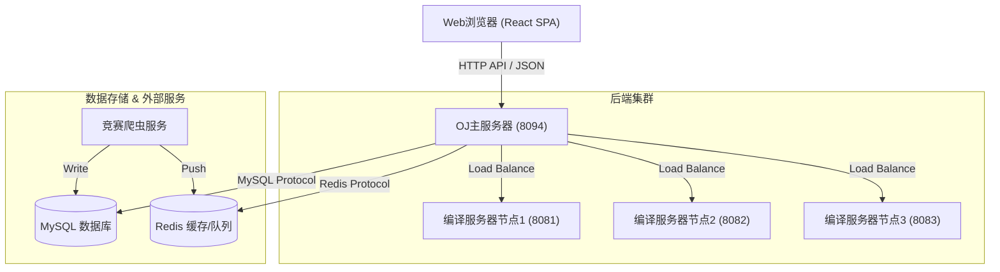
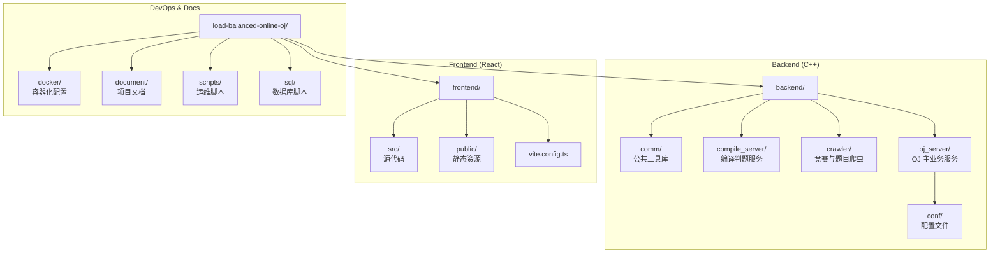

# 负载均衡式在线评测系统 (Load-Balanced Online Judge)

> **"不仅仅是评测，更是算法爱好者的全能训练场。"**
>
> 一个基于 C++11 和 React 19 构建的高性能分布式 Online Judge 系统。支持多编译服务器负载均衡、实时评测反馈、竞赛数据抓取以及沉浸式的用户体验。


## 🚀 项目概述

本项目是一个企业级的分布式在线评测系统，旨在解决传统 OJ 系统在高并发场景下的性能瓶颈。通过**负载均衡**策略将评测任务分发至多个编译服务器，实现了高吞吐量的代码评测。

不仅如此，我们还引入了**现代化前端技术栈**，打造了一个响应迅速、视觉优雅的单页应用 (SPA)。从基础的题目练习到专业的竞赛训练，再到休闲的娱乐中心，为用户提供一站式的编程学习体验。

## ✨ 核心功能

### 核心评测能力
- **⚡️ 分布式负载均衡**：通过智能调度算法，将评测任务自动分发至空闲的编译服务器节点，支持水平扩展。
- **🛡️ 安全沙箱机制**：基于 Linux Namespace 和 cgroups 技术，实现网络隔离、权限降级 (nobody) 和资源熔断，严防恶意代码攻击。
- **🔄 实时评测反馈**：毫秒级的评测响应，实时推送编译结果与测试用例通过情况。

### 现代化体验
- **🎨 极简深色 UI**：基于 React 19 + Shadcn UI 打造的现代化深色主题界面，专注于代码阅读体验。
- **📱 单页应用 (SPA)**：全站无刷新跳转，提供丝滑的操作流畅度。
- **📝 社区互动**：支持 Markdown 发帖、代码高亮、数学公式 (LaTeX) 渲染及行内评论。

### 特色模块
- **📋 智能题单 (Training Lists)**：支持拖拽排序的自定义题单系统，轻松规划刷题路线。
- **🕷️ 竞赛爬虫 (Contest Crawler)**：内置高性能 C++ 爬虫，自动同步 Codeforces 和 LeetCode 的最新赛事信息。
- **🎮 娱乐中心 (Entertainment)**：刷题累了？内置超级玛丽、推箱子、Chrome Dino 等经典游戏的复刻版，劳逸结合。
- **👤 个性化中心**：支持头像上传、个人数据统计及详细的提交记录分析。

## 📸 界面预览

| 首页概览 | 题目列表 |
| :---: | :---: |
|  |  |
| **代码编辑与评测** | **娱乐中心** |
|  |  |

## 🛠️ 技术架构

系统采用经典的前后端分离架构，后端基于微服务思想设计，前端采用现代 SPA 方案。



### 技术栈详情

- **前端**: React 19, TypeScript, Vite, TailwindCSS, Shadcn UI, Zustand, Axios, KaTeX
- **后端**: C++11, httplib (基于 cpp-httplib), JSONCpp, MySQL Connector
- **中间件**: Redis (缓存与消息队列), hiredis (C++ Redis Client)
- **运维**: Docker, Docker Compose, Makefile, Shell Scripts
- **测试**: Playwright (E2E Testing), Google Test (Unit Testing)

## 💻 开发指南 (Development Guide)

本指南将帮助你快速搭建本地开发环境。

### 1. 前端开发 (Frontend)

前端项目位于 `frontend/` 目录，采用 React 19 + Vite + TypeScript 技术栈。

**环境要求**:
- Node.js: v18.0.0+
- 包管理器: npm (推荐 v9+)

```bash
cd frontend

# 1. 安装依赖
npm install

# 2. 启动开发服务器 (热重载)
npm run dev
# 访问: http://localhost:5173

# 3. 构建生产环境代码
npm run build
# 产物目录: frontend/dist

# 4. 本地预览构建产物
npm run preview

# 5. 代码风格检查
npm run lint
```
> **提示**: 开发服务器默认开启了代理 (Proxy)，会自动将 `/api`, `/judge` 等请求转发至后端的 `http://localhost:8094`，无需手动配置跨域。

### 2. 后端开发 (Backend)

后端项目位于 `backend/` 目录，建议在 Linux/macOS 环境下开发。

**环境要求**:
- G++ (支持 C++11)
- MySQL Server
- Redis Server
- hiredis (Redis C++ Client)
- jsoncpp, mysql-connector-c++

**依赖安装 (Ubuntu/Debian)**:
```bash
sudo apt-get update
sudo apt-get install g++ make libmysqlclient-dev libjsoncpp-dev libhiredis-dev redis-server
```

**依赖安装 (macOS)**:
```bash
brew install mysql redis hiredis jsoncpp
```

**编译与运行**:
```bash
# 编译所有模块并生成发布目录 (推荐)
make output

# 或者分别编译各个组件 (调试用)
make -C backend/oj_server
make -C backend/compile_server
```

### 3. 运行与调试

#### 方式 A: 脚本一键启动 (推荐)
```bash
# 启动所有服务 (OJ Server + 3个 Compile Server)
./scripts/start.sh

# 停止所有服务
./scripts/stop.sh
```

#### 方式 B: 手动独立启动
适用于需要单独调试某个模块的场景。

```bash
# 启动编译服务器 (指定端口)
./backend/compile_server/compile_server 8081

# 启动 OJ 主服务器
./backend/oj_server/oj_server
```

## ⚙️ 配置文件说明

系统核心配置位于 `backend/oj_server/conf/` 目录下。

### 1. 本地开发配置 (`service_machine.conf`)
用于本地直接运行 (`./oj_server`) 时加载的编译服务器列表。
```conf
# 格式: IP:Port
127.0.0.1:8081
127.0.0.1:8082
127.0.0.1:8083
```

### 2. Docker 部署配置 (`service_machine_docker.conf`)
用于 Docker 容器环境。由于容器间通过服务名通信，此处配置的是 Docker Compose 中的服务名称。
```conf
# 格式: ServiceName:Port
compile_server_1:8081
compile_server_2:8082
```

## ❓ 常见问题 (Troubleshooting)

**Q: 启动时提示端口被占用 (Address already in use)?**
> A: 请检查是否有旧的进程未关闭。可以使用 `./scripts/stop.sh` 强行停止所有相关进程，或者使用 `lsof -i :8094` 查找并 kill 掉占用端口的进程。

**Q: 数据库连接失败?**
> A: 请确保 MySQL 服务已启动，并且 `backend/oj_server/oj_model.hpp` 中的数据库连接配置（用户名/密码）与你的本地环境一致。默认配置通常为 `root` 用户。

**Q: 爬虫无法启动或 Redis 连接失败?**
> A: 请确保 Redis 服务已启动并在默认端口 (6379) 监听。

**Q: 前端页面显示 "Network Error"?**
> A: 这通常意味着后端服务未启动。请确保 `oj_server` 正在运行并在监听 8094 端口。

**Q: 提交代码后一直显示 "Pending"?**
> A: 请检查 `compile_server` 是否已启动。如果 `oj_server` 无法连接到任何一个编译服务器，任务将会积压。

## 🏗️ 项目结构



## 📚 详细文档

更多技术细节请参阅 [文档中心 (Documentation Center)](document/README.md)：
- [架构设计 (Architecture)](document/architecture/overview.md)
- [API 接口规范 (API Reference)](document/api/reference.md)
- [数据库设计 (Database)](document/architecture/database.md)
- [前端样式指南 (Frontend Style Guide)](document/standards/frontend.md)
- [开发规范 (Development Standards)](document/standards/development.md)
- [部署指南 (Deployment)](document/deployment/docker_deployment.md)

## 📝 更新日志 (Changelog)

### v2.0.4 (2026-03-12)
- **Problem List Pagination**: Enhanced pagination with "First Page" and "Last Page" buttons, and a direct page jump input. The pagination controls are now centered.

### v2.0.1 (2026-03-12)
- **Markdown 公式支持**: 引入 KaTeX 支持 LaTeX 数学公式渲染。
- **布局修复**: 修复 React 重构后的导航栏抖动和容器宽度问题。

### v2.0.0 (2026-03-11) - React 重构版
- **前端重构**: 全面迁移至 React 19 + Vite + TypeScript 技术栈。
- **UI 升级**: 引入 Shadcn UI 和 TailwindCSS，支持深色模式。
- **架构调整**: 后端代码统一迁移至 `backend/` 目录，实现前后端分离。
- **性能优化**: 首页 LCP 优化至 0.8s，构建产物自动分割。

### v1.3.1 (2026-03-10)
- **编译器修复**: 修复编译器启动失败时的错误信息显示。
- **语言兼容**: 增加对 C++/Java/Python 语言别名的容错处理。

### v1.2.2 (2026-03-10)
- **项目结构**: 规范化目录结构，清理冗余静态资源。

---
**Maintained by**: Load-Balanced Online Judge Team
