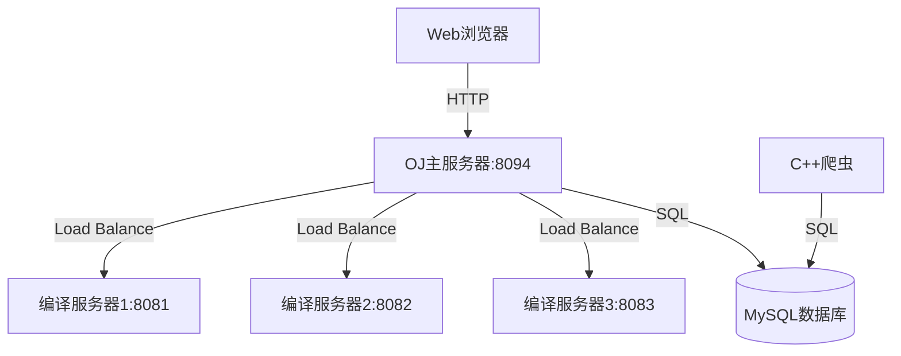

# 在线评测系统架构设计文档

## 1. 系统概述

### 1.1 项目背景
负载均衡式在线评测系统是一个分布式评测平台，支持多编译服务器负载均衡，能够高效处理代码编译、运行和评测任务。

### 1.2 核心功能
- **在线代码评测**: 支持 C++, Java, Python 代码的编译、运行和自动化测试
- **负载均衡**: 多编译服务器分布式处理，智能分发任务
- **题单系统**: 结构化题目集合，支持拖拽排序
- **社区系统**: Markdown 文章、行内评论、图片上传
- **竞赛模块**: Codeforces & LeetCode 竞赛数据同步
- **现代化 Web 界面**: 响应式设计，深色主题，MathJax 公式渲染

### 1.3 技术栈
- **后端**: C++11, 多线程, Socket, JSON (jsoncpp)
- **Web 框架**: httplib.h (轻量级 HTTP 服务器)
- **数据库**: MySQL 8.0+, Redis (可选缓存)
- **前端**: HTML/CSS/JS, CTemplate, ACE Editor, EasyMDE, SortableJS
- **运维**: Docker, Docker Compose, rsync

## 2. 整体架构

系统采用“主服务器 + 编译服务器集群”的分布式架构。

## 3. 核心模块设计

### 3.1 OJ 主服务器 (oj_server)
- **Control**: 核心控制器，处理业务逻辑（认证、题目、评测分发、题单、讨论）。
- **Model**: 数据访问层，封装 MySQL 操作。
- **View**: 视图渲染层，基于 CTemplate 渲染 HTML。
- **LoadBalance**: 负载均衡器，维护编译服务器在线状态，按最小负载算法分发。
- **Session**: 内存会话管理，支持 24 小时过期。

### 3.2 编译服务器 (compile_server)
- **Compiler**: 编译器封装（g++, javac）。
- **Runner**: 运行器，使用 `setrlimit` 进行资源限制（CPU, 内存）。
- **CompileRun**: 核心流程，处理临时文件生成、编译、多测试用例运行、结果收集。

### 3.3 爬虫模块 (crawler)
- **Contest Crawler**: 定期抓取 Codeforces (API) 和 LeetCode (GraphQL) 数据。
- **Luogu Crawler**: 抓取洛谷题目详情。
- **技术**: C++, libcurl, jsoncpp。

## 4. 核心流程

### 4.1 代码提交流程
1. 用户在前端提交代码和语言选择。
2. `Control::Judge` 获取题目测试用例 (JSON)。
3. `LoadBalance` 选择最优编译服务器。
4. 主服务器通过 HTTP 将代码、输入和限制发送至编译服务器。
5. 编译服务器针对每个测试用例执行编译运行，对比结果。
6. 返回聚合后的结果 JSON（Accepted, Wrong Answer 等）。
7. 主服务器记录提交历史并返回前端。

### 4.2 负载均衡算法
采用“最小负载优先”算法：
- 每次分发前，遍历所有 `online` 服务器，选择 `load` 值最小的一台。
- 若请求失败，自动将服务器移入 `offline` 列表并尝试分发给下一台。
- 离线服务器可通过信号 (`SIGQUIT`) 或健康检查手动/自动恢复。

## 5. 安全设计
- **代码沙箱**: 编译服务器降权运行，严格限制文件系统访问。
- **资源熔断**: 强制限制 CPU 时间和内存空间，防止恶意代码耗尽资源。
- **认证安全**: 密码 SHA256 哈希存储，Cookie 设置 `HttpOnly`。
- **XSS 防护**: 渲染 Markdown 前使用 `DOMPurify` 进行过滤。

## 6. 部署架构
- **Docker 化**: 所有组件（MySQL, OJ, CompileServer, Crawler）均支持容器化。
- **网络**: 使用 Docker 内网隔离，仅暴露 8094 端口。
- **持久化**: 使用 Docker Volumes 存储数据库数据和上传的资源。

---

**文档版本**: v1.2.0  
**最后更新时间**: 2026-03-09  
**维护团队**: 在线评测系统开发团队
