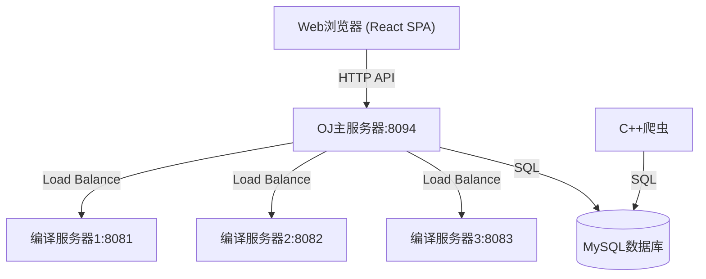

# 在线评测系统架构设计文档

## 1. 系统概述

### 1.1 项目背景
负载均衡式在线评测系统是一个分布式评测平台，支持多编译服务器负载均衡，能够高效处理代码编译、运行和评测任务。

### 1.2 核心功能
- **在线代码评测**: 支持 C++, Java, Python 代码的编译、运行和自动化测试
- **负载均衡**: 多编译服务器分布式处理，智能分发任务
- **题单系统**: 结构化题目集合，支持拖拽排序
- **社区系统**: Markdown 文章、行内评论、图片上传
- **竞赛模块**: Codeforces & LeetCode 竞赛数据同步
- **现代化 Web 界面**: 响应式设计，深色主题，MathJax 公式渲染

### 1.3 技术栈
- **后端**: C++11, 多线程, Socket, JSON (jsoncpp)
- **Web 框架**: httplib.h (轻量级 HTTP 服务器)
- **数据库**: MySQL 8.0+, Redis (可选缓存)
- **前端**: React 19, Vite, TypeScript, TailwindCSS, Shadcn UI, Zustand
- **运维**: Docker, Docker Compose, Multi-stage Build

## 2. 整体架构

系统采用“前端 SPA + 后端 API”的分离式架构。前端作为单页应用运行在用户浏览器中，通过 RESTful API 与后端进行交互。

## 3. 核心模块设计

### 3.1 前端应用 (frontend)
- **Framework**: React 19 + Vite + TypeScript，采用 SPA (单页应用) 架构。
- **UI Components**: 
    - **Shadcn UI**: 基于 Radix UI 的无头组件库，提供高质量的交互体验。
    - **TailwindCSS**: 原子化 CSS 框架，实现快速响应式布局。
    - **Lucide React**: 统一的图标库。
- **State Management**: **Zustand**，管理用户会话 (`auth.ts`)、题目列表等全局状态，相比 Redux 更轻量高效。
- **Routing**: **React Router v7**，管理页面路由与权限控制 (`ProtectedRoute`)。
- **Network**: **Axios** 封装 (`src/lib/axios.ts`)，统一处理请求拦截、响应错误 (401/500) 和超时。
- **Editor**: **Monaco Editor** (`@monaco-editor/react`)，提供类 VS Code 的代码编辑体验。
- **Build**: 构建产物 (HTML/JS/CSS) 部署在 `backend/oj_server/wwwroot` 目录，由后端静态文件服务提供。

**组件交互流程**:
1. **View (Page/Component)**: 用户触发操作 (如点击登录)。
2. **Store (Zustand)**: 调用 Action (如 `login`)。
3. **Service (API Layer)**: `authService` 调用 `axios` 发送 HTTP 请求。
4. **Backend**: 处理请求并返回 JSON。
5. **Store**: 更新状态 (`user`, `isAuthenticated`)。
6. **View**: 自动重新渲染 UI。

### 3.2 OJ 主服务器 (backend/oj_server)
- **Control**: 核心控制器，处理 API 请求（认证、题目、评测分发、题单、讨论）。
- **Model**: 数据访问层，封装 MySQL 操作。
- **View**: 静态资源服务层，不再负责 HTML 模板渲染，而是返回 JSON 数据或静态文件。
- **LoadBalance**: 负载均衡器，维护编译服务器在线状态，按最小负载算法分发。
- **Session**: 内存会话管理，支持 24 小时过期。

### 3.3 编译服务器 (backend/compile_server)
- **Compiler**: 编译器封装（g++, javac）。
- **Runner**: 运行器，使用 `setrlimit` 进行资源限制（CPU, 内存）。
- **CompileRun**: 核心流程，处理临时文件生成、编译、多测试用例运行、结果收集。

### 3.4 爬虫模块 (backend/crawler)
- **Contest Crawler**: 定期抓取 Codeforces (API) 和 LeetCode (GraphQL) 数据。
- **Luogu Crawler**: 抓取洛谷题目详情。
- **技术**: C++, libcurl, jsoncpp。

## 4. 核心流程

### 4.1 代码提交流程
1. 用户在 React 前端提交代码和语言选择（调用 `/api/judge`）。
2. `Control::Judge` 接收请求，获取题目测试用例 (JSON)。
3. `LoadBalance` 选择最优编译服务器。
4. 主服务器通过 HTTP 将代码、输入和限制发送至编译服务器。
5. 编译服务器针对每个测试用例执行编译运行，对比结果。
6. 返回聚合后的结果 JSON（Accepted, Wrong Answer 等）。
7. 主服务器记录提交历史并返回 JSON 响应，前端实时更新界面。

### 4.2 负载均衡算法
采用“最小负载优先”算法：
- 每次分发前，遍历所有 `online` 服务器，选择 `load` 值最小的一台。
- 若请求失败，自动将服务器移入 `offline` 列表并尝试分发给下一台。
- 离线服务器可通过信号 (`SIGQUIT`) 或健康检查手动/自动恢复。

## 5. 安全设计
- **代码沙箱**: 编译服务器降权运行，严格限制文件系统访问。
- **资源熔断**: 强制限制 CPU 时间和内存空间，防止恶意代码耗尽资源。
- **认证安全**: 密码 SHA256 哈希存储，Cookie 设置 `HttpOnly`。
- **XSS 防护**: 渲染 Markdown 前使用 `DOMPurify` 进行过滤。

## 6. 部署架构
- **Docker 化**: 所有组件（MySQL, OJ, CompileServer, Crawler）均支持容器化。
- **网络**: 使用 Docker 内网隔离，仅暴露 8094 端口。
- **持久化**: 使用 Docker Volumes 存储数据库数据和上传的资源。

---

**文档版本**: v1.2.2
**最后更新时间**: 2026-03-11
**维护团队**: 在线评测系统开发团队
