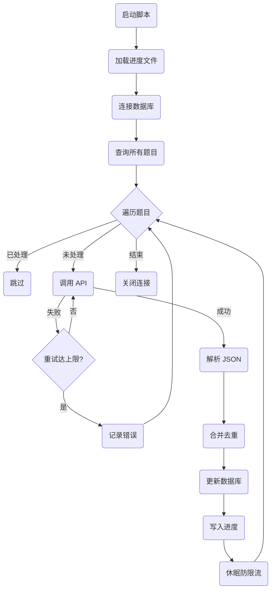

# 巧用大语言模型（LLM）自动化扩充 OJ 系统测试数据：Python 脚本实战

在开发和维护 Online Judge（在线评测系统，简称 OJ）时，我们经常会遇到一个棘手的问题：**题目测评数据太少**。尤其是当题目是从外部平台抓取，且外部平台隐藏了大部分测试用例时，用户提交代码后往往只能通过寥寥几个基础样例，无法验证代码的鲁棒性与边界条件处理。

为了解决这一问题，提升 OJ 系统的可用性和评测准确性，我们决定引入大语言模型（LLM）——在这里我们使用了强大的 **DeepSeek API**，编写了一个 Python 自动化脚本，根据题目描述智能生成补充测试用例，并安全地合并到我们的数据库中。

本文将详细介绍该脚本的设计思路、核心架构以及具体实现细节，带你领略“AI 赋能传统业务”的魅力。（如果你想直接使用，**可以直接拉到文末获取完整可运行的脚本代码**）。

---

## 1. 痛点分析与核心挑战

在动手写代码之前，我们需要解决以下几个核心挑战：

- **挑战一：输出格式不可控**。大模型倾向于输出自然语言，而 OJ 评测机需要严格的 JSON 格式（如 `[{"input": "...", "expect": "..."}]`）。
- **挑战二：数据重复问题**。新生成的测试用例不能与原有测试用例重复，否则会浪费宝贵的评测资源和时间。
- **挑战三：网络波动与接口限流**。批量处理几千道题目，极易遇到网络异常或触发 API 的并发限流（Rate Limit）。
- **挑战四：中断与恢复（断点续传）**。如果跑了几百题后程序崩溃，重新跑需要跳过已处理的题目，避免重复调用 API 产生高昂费用。

针对以上挑战，我们的解决方案如下：

- **Prompt 工程 + 正则兜底**：在 Prompt 中明确要求只输出 JSON 数组，并在代码中加入正则表达式提取 Markdown 代码块内的 JSON 数据。
- **字段级去重合并**：解析现有测试用例和新用例，以 `input` 字段为唯一键（Key）进行去重合并。
- **重试机制与速率限制**：引入带指数退避（Exponential Backoff）的重试机制，每次请求后强制休眠。
- **本地进度缓存**：使用本地 `json` 文件记录已成功处理的题目 ID，每次启动时优先加载该文件。

---

## 2. 系统工作流程图（Workflow）

为了让大家更直观地理解整个脚本的运行机制，我们使用 Mermaid 绘制了脚本的整体处理逻辑：



---

## 3. 核心代码模块解析

下面我们将拆解脚本中的几个核心模块，看看上述的解决方案是如何在代码中落地的。

### 3.1 健壮的 JSON 提取器：防御性编程

大语言模型有时会在 JSON 外面包裹 ```json 和 ``` 标记，甚至附带一两句诸如“这是您需要的 JSON 数据”的客套话。为了确保解析不报错，我们使用了正则表达式进行兜底提取：

```python
def extract_json_from_text(text):
    """通过正则提取并解析大模型返回文本中的 JSON 数组"""
    # 尝试匹配 markdown 代码块中的 JSON 数组
    match = re.search(r'```(?:json)?\s*(\[.*?\])\s*```', text, re.DOTALL)
    json_str = ""
    if match:
        json_str = match.group(1)
    else:
        # 降级：直接尝试寻找被 [] 包裹的内容
        match = re.search(r'\[.*\]', text, re.DOTALL)
        if match:
            json_str = match.group(0)
    
    try:
        return json.loads(json_str)
    except json.JSONDecodeError as e:
        logging.error(f"JSON 解析失败: {e}")
        return None
```
这种“防御性编程”极大地提高了大模型输出结果的可用率。

### 3.2 数据合并与去重逻辑：保护现有数据

获取到新用例后，我们需要将其与数据库中原有的 `tail_code` 合并。为了避免产生完全相同的测试输入，我们使用一个 `Set` 来记录已存在的输入样例。

```python
def merge_and_deduplicate(existing_tail_code, new_cases):
    existing_cases = []
    if existing_tail_code and str(existing_tail_code).strip():
        try:
            existing_cases = json.loads(existing_tail_code)
        except json.JSONDecodeError:
            existing_cases = []

    seen_inputs = set()
    merged_cases = []
    
    # 优先遍历原有的用例，再遍历新用例
    for case in existing_cases + new_cases:
        if isinstance(case, dict) and 'input' in case and 'expect' in case:
            input_str = str(case['input']).strip()
            # 基于 input 进行去重
            if input_str not in seen_inputs:
                seen_inputs.add(input_str)
                merged_cases.append(case)
                
    return json.dumps(merged_cases, ensure_ascii=False)
```

### 3.3 API 请求与重试机制：应对网络波动

网络请求总是不可靠的，尤其是批量处理几千条数据时。我们利用一个简单的 `for` 循环实现了带指数退避的重试机制：

```python
def call_deepseek_api(description):
    headers = {
        'Content-Type': 'application/json',
        'Authorization': f'Bearer <YOUR_API_KEY>'
    }
    
    prompt = (
        "根据以下编程题目的描述，生成 3 到 5 个测试用例。\n"
        "必须严格按照以下 JSON 数组格式输出，不要包含任何其他解释文字或 markdown 格式：\n"
        '[{"input": "输入样例1", "expect": "预期输出1"}, {"input": "输入样例2", "expect": "预期输出2"}]\n\n'
        f"题目描述：\n{description}"
    )

    data = {
        "model": "deepseek-chat",
        "messages": [
            {"role": "system", "content": "你是一个严谨的编程测试用例生成助手。只输出合法的 JSON 数组，不附加任何其他文本。"},
            {"role": "user", "content": prompt}
        ],
        "temperature": 0.3
    }
    
    for attempt in range(1, MAX_RETRIES + 1):
        try:
            response = requests.post(DEEPSEEK_API_URL, headers=headers, json=data, timeout=30)
            response.raise_for_status()
            
            # 解析并提取 JSON
            content = response.json()['choices'][0]['message']['content']
            parsed_json = extract_json_from_text(content)
            
            if parsed_json is not None:
                return parsed_json
        except Exception as e:
            logging.warning(f"第 {attempt} 次尝试请求失败: {e}")
        
        if attempt < MAX_RETRIES:
            # 失败后指数退避重试 (例如 2s, 4s, 6s)
            time.sleep(RATE_LIMIT_DELAY * attempt)
            
    return None
```

### 3.4 断点续传的设计：节约时间和成本

如果在处理第 1500 题时程序被终止，我们绝对不想从第 1 题重新开始。利用一个简单的 JSON 文件保存 `Set` 集合即可完美解决：

```python
def main():
    processed_numbers = load_progress() # 从本地加载已处理的题目 ID 集合
    
    # 连接数据库 (此处隐去真实的数据库配置)
    connection = pymysql.connect(**DB_CONFIG)
    cursor = connection.cursor()
    
    cursor.execute("SELECT number, description, tail_code FROM oj_questions")
    questions = cursor.fetchall()
    
    for q in questions:
        number = str(q['number'])
        if number in processed_numbers:
            continue # 跳过已处理的题目
            
        description = q['description']
        existing_tail_code = q['tail_code']

        # 请求大模型生成用例
        new_cases = call_deepseek_api(description)
        
        if new_cases:
            # 合并并去重
            updated_tail_code = merge_and_deduplicate(existing_tail_code, new_cases)
            
            try:
                # 更新回数据库
                cursor.execute(
                    "UPDATE oj_questions SET tail_code = %s WHERE number = %s",
                    (updated_tail_code, number)
                )
                connection.commit()
                
                # 更新成功后，将 ID 加入集合并持久化到硬盘
                processed_numbers.add(number)
                save_progress(processed_numbers)
            except Exception as e:
                connection.rollback()
        
        # 强制休眠，防止触发 API 速率限制
        time.sleep(RATE_LIMIT_DELAY)
```

---

## 4. 总结与展望

通过上述短短两三百行 Python 代码，我们实现了一个高可用、可重入的 OJ 测试数据自动化生成工具。它具备以下优势：

1. **解放人力**：无需人工逐题编写边界测试用例。
2. **高容错性**：从正则解析兜底到网络重试机制，确保批量任务无人值守依然稳定运行。
3. **安全可控**：平滑合并旧数据、去重并持久化进度，保证了系统数据库的安全。

大语言模型的应用绝不仅仅局限于聊天对话，将其与传统业务系统的痛点结合，往往能产生惊人的生产力提升。希望这篇文章能为有类似数据扩充需求的开发者提供一些灵感！

---

## 附录：完整可运行脚本

以下是经过脱敏处理的完整可运行脚本（`add_test_data.py`）。在运行前，请确保安装了必要的依赖（`pip install pymysql requests`），并替换为您自己的数据库配置与 DeepSeek API Key。

```python
import os
import json
import time
import re
import pymysql
import requests
import logging

# 配置日志格式
logging.basicConfig(level=logging.INFO, format='%(asctime)s - %(levelname)s - %(message)s')

# MySQL 数据库配置
DB_CONFIG = {
    'host': '127.0.0.1',
    'user': '<YOUR_DB_USER>',
    'password': '<YOUR_DB_PASSWORD>',
    'database': 'oj',
    'port': 3306,
    'charset': 'utf8mb4',
    'cursorclass': pymysql.cursors.DictCursor
}

# DeepSeek API 配置
DEEPSEEK_API_KEY = '<YOUR_DEEPSEEK_API_KEY>'
DEEPSEEK_API_URL = 'https://api.deepseek.com/chat/completions'

# 进度保存文件与相关配置
PROGRESS_FILE = 'scripts/add_test_progress.json'
MAX_RETRIES = 3
RATE_LIMIT_DELAY = 2  # 每次请求后休眠2秒

def load_progress():
    """加载已处理过的题目编号列表"""
    if os.path.exists(PROGRESS_FILE):
        try:
            with open(PROGRESS_FILE, 'r', encoding='utf-8') as f:
                return set(json.load(f))
        except Exception as e:
            logging.error(f"无法加载进度文件: {e}")
    return set()

def save_progress(progress_set):
    """保存已处理的题目编号列表到文件"""
    os.makedirs(os.path.dirname(PROGRESS_FILE), exist_ok=True)
    with open(PROGRESS_FILE, 'w', encoding='utf-8') as f:
        json.dump(list(progress_set), f)

def extract_json_from_text(text):
    """通过正则提取并解析大模型返回文本中的 JSON 数组"""
    # 尝试匹配 markdown 代码块中的 JSON 数组
    match = re.search(r'```(?:json)?\s*(\[.*?\])\s*```', text, re.DOTALL)
    json_str = ""
    if match:
        json_str = match.group(1)
    else:
        # 降级：直接尝试寻找被 [] 包裹的内容
        match = re.search(r'\[.*\]', text, re.DOTALL)
        if match:
            json_str = match.group(0)
    
    if not json_str:
        logging.error("未能从返回结果中匹配到 JSON 数组。")
        return None

    try:
        return json.loads(json_str)
    except json.JSONDecodeError as e:
        logging.error(f"JSON 解析失败: {e}\n原文提取为:\n{json_str}")
        return None

def call_deepseek_api(description):
    """调用 DeepSeek API 生成测试用例，包含重试机制"""
    headers = {
        'Content-Type': 'application/json',
        'Authorization': f'Bearer {DEEPSEEK_API_KEY}'
    }
    
    prompt = (
        "根据以下编程题目的描述，生成 3 到 5 个测试用例。\n"
        "必须严格按照以下 JSON 数组格式输出，不要包含任何其他解释文字或 markdown 格式：\n"
        '[{"input": "输入样例1", "expect": "预期输出1"}, {"input": "输入样例2", "expect": "预期输出2"}]\n\n'
        f"题目描述：\n{description}"
    )

    data = {
        "model": "deepseek-chat",
        "messages": [
            {"role": "system", "content": "你是一个严谨的编程测试用例生成助手。只输出合法的 JSON 数组，不附加任何其他文本。"},
            {"role": "user", "content": prompt}
        ],
        "temperature": 0.3
    }

    for attempt in range(1, MAX_RETRIES + 1):
        try:
            response = requests.post(DEEPSEEK_API_URL, headers=headers, json=data, timeout=30)
            response.raise_for_status()
            result = response.json()
            
            content = result['choices'][0]['message']['content']
            parsed_json = extract_json_from_text(content)
            
            if parsed_json is not None and isinstance(parsed_json, list):
                return parsed_json
            else:
                logging.warning(f"第 {attempt} 次尝试：返回的数据格式无效或不是数组。")
        except Exception as e:
            logging.warning(f"第 {attempt} 次尝试请求失败: {e}")
        
        if attempt < MAX_RETRIES:
            # 失败后指数退避重试
            time.sleep(RATE_LIMIT_DELAY * attempt)
    
    return None

def merge_and_deduplicate(existing_tail_code, new_cases):
    """解析现有 test cases 并与新生成的 cases 合并，基于 input 去重"""
    existing_cases = []
    if existing_tail_code and str(existing_tail_code).strip():
        try:
            existing_cases = json.loads(existing_tail_code)
            if not isinstance(existing_cases, list):
                existing_cases = []
        except json.JSONDecodeError:
            logging.warning("原有的 tail_code 不是有效的 JSON 数组，将忽略原数据。")
            existing_cases = []

    seen_inputs = set()
    merged_cases = []
    
    # 优先保留原有的测试用例
    for case in existing_cases + new_cases:
        if isinstance(case, dict) and 'input' in case and 'expect' in case:
            # 标准化 input 用于去重比较
            input_str = str(case['input']).strip()
            if input_str not in seen_inputs:
                seen_inputs.add(input_str)
                merged_cases.append(case)
                
    return json.dumps(merged_cases, ensure_ascii=False)

def main():
    processed_numbers = load_progress()
    logging.info(f"已加载 {len(processed_numbers)} 个已处理题目的进度记录。")

    # 连接数据库
    try:
        connection = pymysql.connect(**DB_CONFIG)
        cursor = connection.cursor()
        logging.info("成功连接到 MySQL 数据库。")
    except Exception as e:
        logging.error(f"连接数据库失败: {e}")
        return

    try:
        cursor.execute("SELECT number, description, tail_code FROM oj_questions")
        questions = cursor.fetchall()
        logging.info(f"数据库中共有 {len(questions)} 道题目。")

        for q in questions:
            number = str(q['number'])
            
            # 如果已经处理过，直接跳过（支持断点续传）
            if number in processed_numbers:
                logging.debug(f"跳过已处理题目: {number}")
                continue

            logging.info(f"开始处理题目 {number} ...")
            
            description = q['description']
            existing_tail_code = q['tail_code']

            # 请求大模型生成用例
            new_cases = call_deepseek_api(description)
            
            if new_cases:
                # 合并并去重
                updated_tail_code = merge_and_deduplicate(existing_tail_code, new_cases)
                
                try:
                    # 更新回数据库
                    cursor.execute(
                        "UPDATE oj_questions SET tail_code = %s WHERE number = %s",
                        (updated_tail_code, number)
                    )
                    connection.commit()
                    logging.info(f"成功更新题目 {number} 的测试用例。")
                    
                    # 记录进度
                    processed_numbers.add(number)
                    save_progress(processed_numbers)
                except Exception as e:
                    connection.rollback()
                    logging.error(f"题目 {number} 数据库更新失败: {e}")
            else:
                logging.error(f"题目 {number} 测试用例生成失败，重试 {MAX_RETRIES} 次后放弃。")

            # 速率限制：每次处理完一题后暂停，避免触发 API 限流
            time.sleep(RATE_LIMIT_DELAY)

    except Exception as e:
        logging.error(f"运行过程中发生错误: {e}")
    finally:
        cursor.close()
        connection.close()
        logging.info("数据库连接已关闭。")

if __name__ == '__main__':
    main()
```