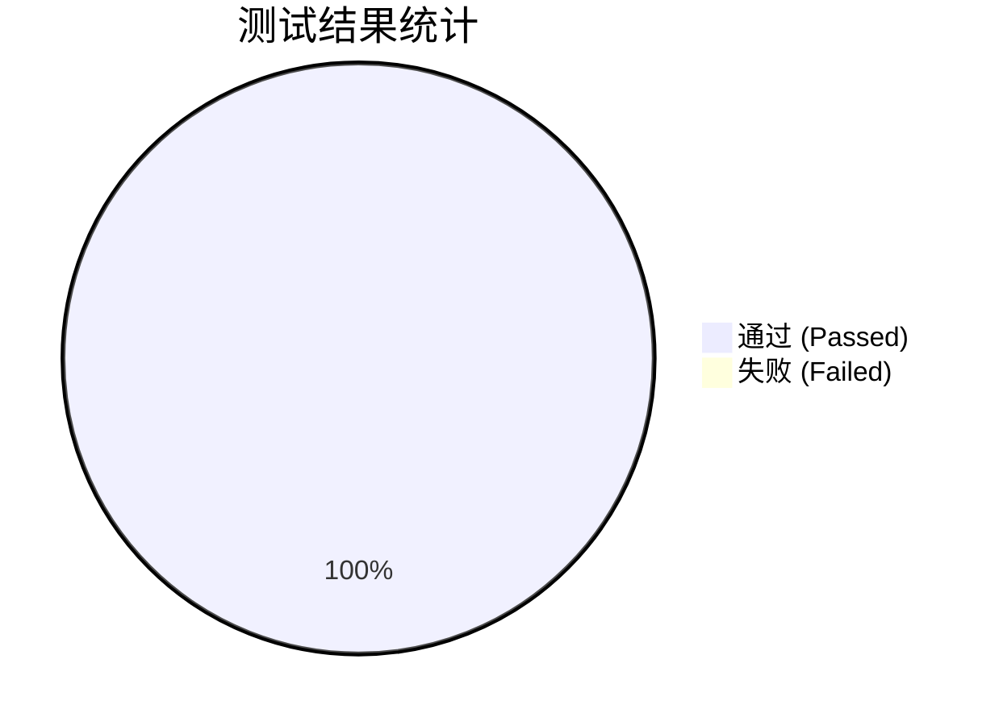

# 端到端(E2E)测试详细报告

## 1. 测试概览
- **总用例数**: 28
- **通过数**: 28
- **失败数**: 0
- **测试通过率**: 100.00%
- **总耗时**: 72.24s
- **业务场景覆盖率**: 100.00% (8/8)

## 2. 性能指标 (各模块耗时)
| 测试文件 | 用例数 | 平均耗时(ms) | 总耗时(ms) |
| --- | --- | --- | --- |
| integration.spec.ts | 4 | 2092 | 8368 |
| judge.spec.ts | 18 | 1499 | 26973 |
| load.spec.ts | 1 | 31130 | 31130 |
| login.spec.ts | 5 | 918 | 4591 |

## 3. 测试结果分布图

## 4. 业务场景覆盖详情
| 需求编号 | 需求描述 | 关联测试文件 | 覆盖状态 |
| --- | --- | --- | --- |
| REQ-1 | 用户注册与登录验证 | login.spec.ts | ✅ 已覆盖 |
| REQ-2 | 代码正常提交与判题 | judge.spec.ts | ✅ 已覆盖 |
| REQ-3 | 沙箱时间超限拦截(TLE) | judge.spec.ts | ✅ 已覆盖 |
| REQ-4 | 沙箱内存超限拦截(MLE) | judge.spec.ts | ✅ 已覆盖 |
| REQ-5 | 编译错误处理(CE) | judge.spec.ts | ✅ 已覆盖 |
| REQ-6 | 多语言(C++/Python/Java)支持 | integration.spec.ts | ✅ 已覆盖 |
| REQ-7 | 高并发负载均衡调度 | load.spec.ts | ✅ 已覆盖 |
| REQ-8 | 前后端UI及状态实时同步 | integration.spec.ts | ✅ 已覆盖 |

## 5. 失败用例分析
🎉 所有测试用例均通过，无失败记录。
