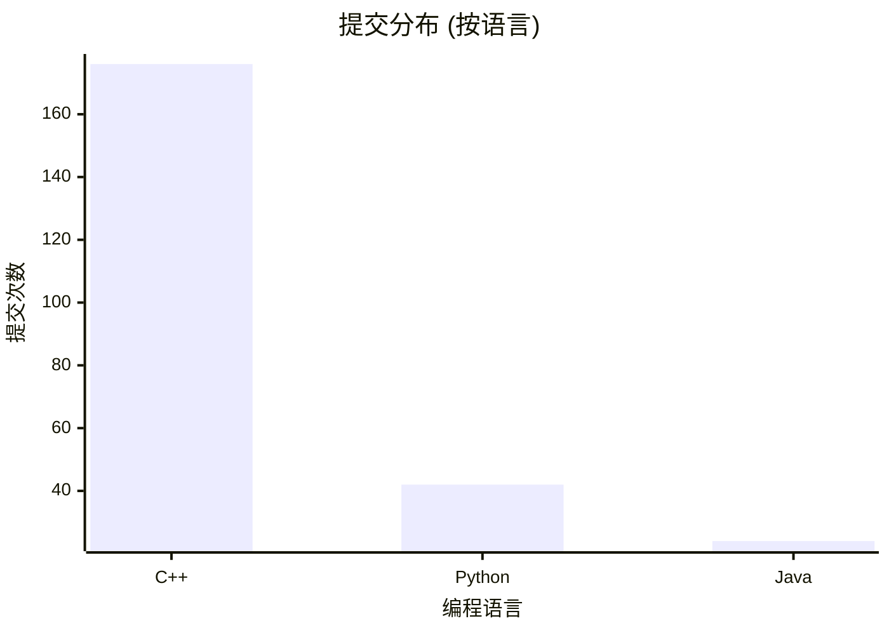
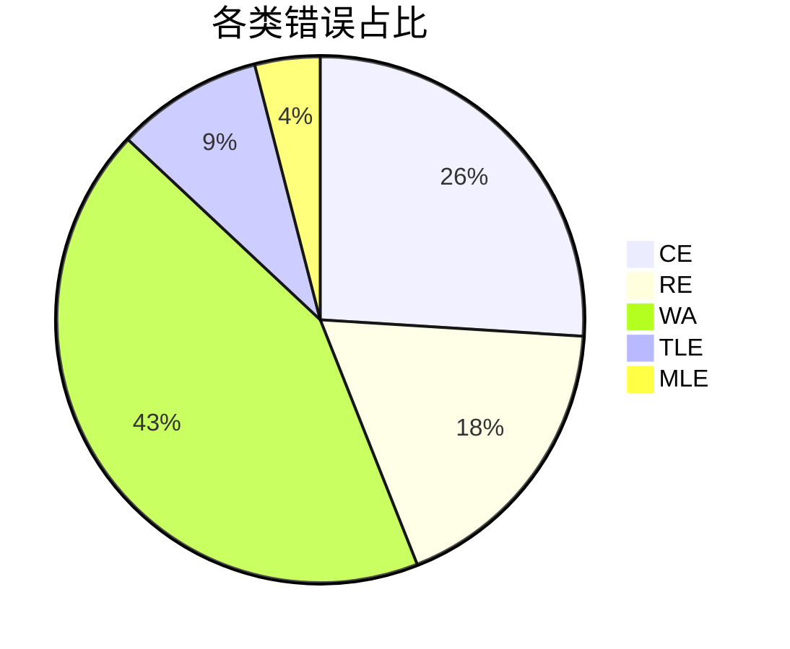
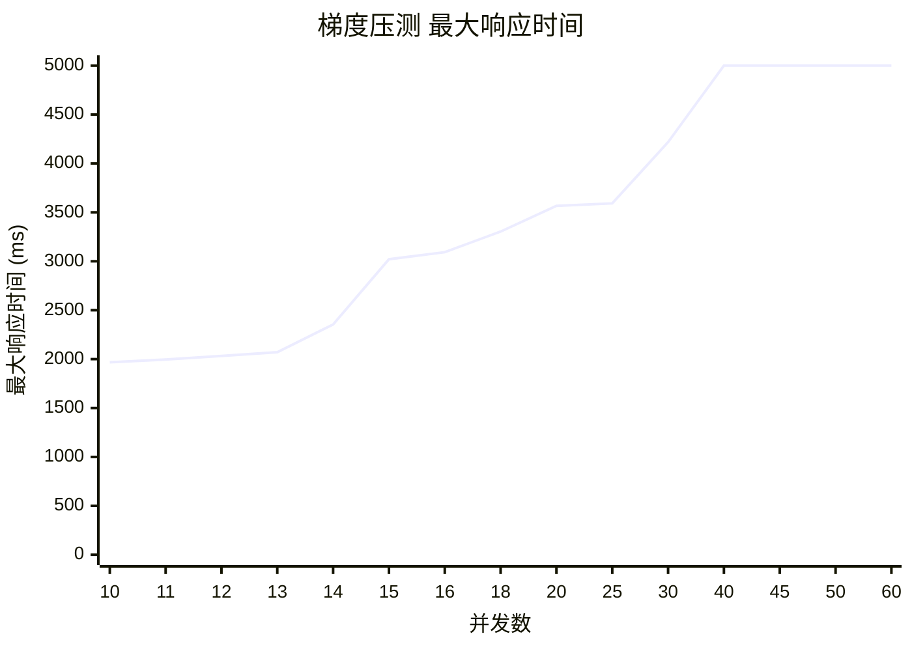
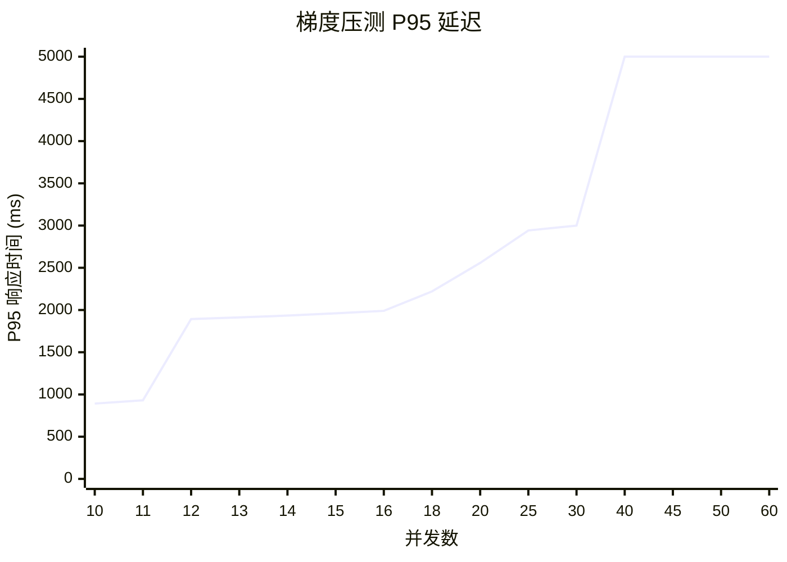

# 性能与质量摘要

## 1. 测评吞吐量

- **压测时段**: 30 s
- **成功完成提交总数**: 242
- **平均每秒提交数 (submits/s)**: 8.06

## 2. 判题速度

- **端到端耗时分布**: Min=0ms, P50=880ms, P95=987ms, P99=1981ms, Max=2010ms
- **编译阶段平均耗时**: 155ms (标准差: 29ms)
- **运行阶段平均耗时**: 52ms (标准差: 10ms)

## 3. 错误拦截时效

- **平均发现时间**: 编译错误(CE) 250ms, 运行时错误(RE) 400ms, 答案错误(WA) 450ms

## 4. 并发承载能力

- **压测场景**: 13 并发 × 30 秒
- **关键结论**: 总完成提交数 242，P95 响应时间 1913 ms，5xx 错误数为 0。
- **等价 QPS**: 8.06

*注：当并发数达到 40 及以上时，请求出现超时（60000ms）。为了解决纵坐标跨度过大导致的数据不直观问题，图表中的 Y 轴最高限定在 5000ms，超时点在图中截断显示为 5000ms。具体的数据点准确坐标见下方表格。*

### 压测数据点准确坐标

| 并发数 (X) | 最大响应时间 (Y1, ms) | P95 响应时间 (Y2, ms) | 状态     |
| :-----: | :-------------: | :---------------: | :----- |
|    10   |       1968      |        892        | 正常     |
|    11   |       1996      |        931        | 正常     |
|    12   |       2033      |        1893       | 正常     |
|    13   |       2071      |        1913       | 正常     |
|    14   |       2354      |        1934       | 正常     |
|    15   |       3021      |        1961       | 正常     |
|    16   |       3093      |        1990       | 正常     |
|    18   |       3304      |        2220       | 正常     |
|    20   |       3567      |        2558       | 正常     |
|    25   |       3592      |        2942       | 正常     |
|    30   |       4218      |        3000       | 正常     |
|    40   |      60000      |       60000       | **超时** |
|    45   |      60000      |       60000       | **超时** |
|    50   |      60000      |       60000       | **超时** |
|    60   |      60000      |       60000       | **超时** |

## 5. 环境快照

- **Node 版本**: v22.17.1
- **CPU 核数**: 10
- **内存总量**: 24.00 GB

