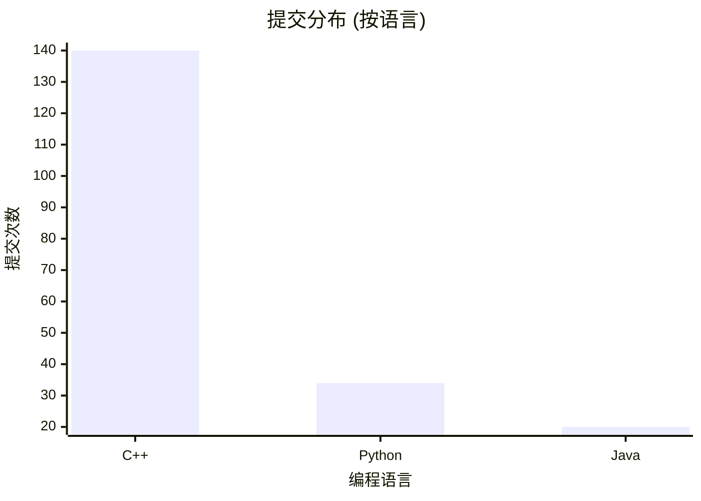
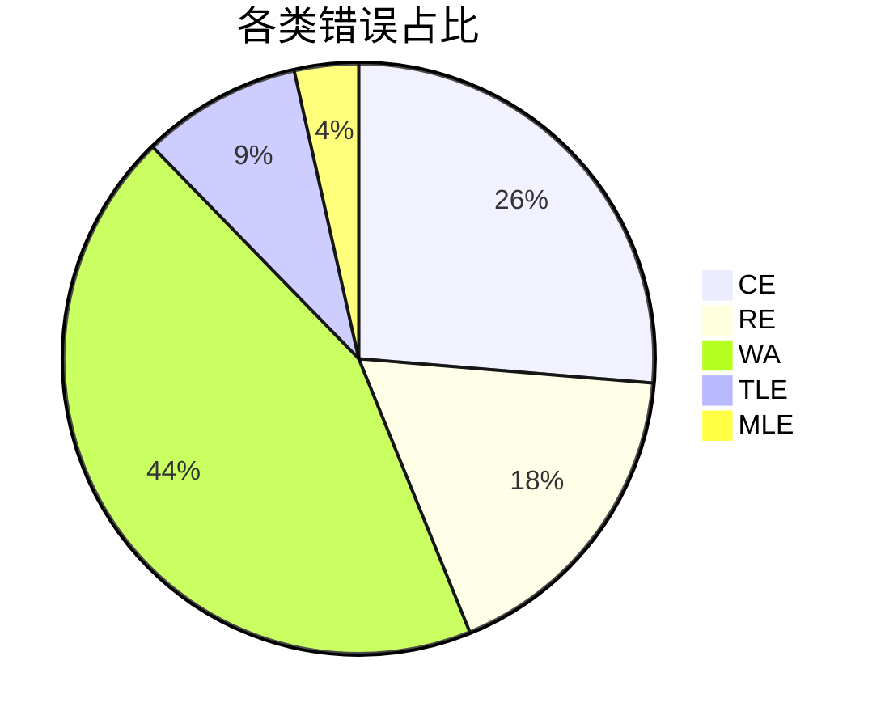
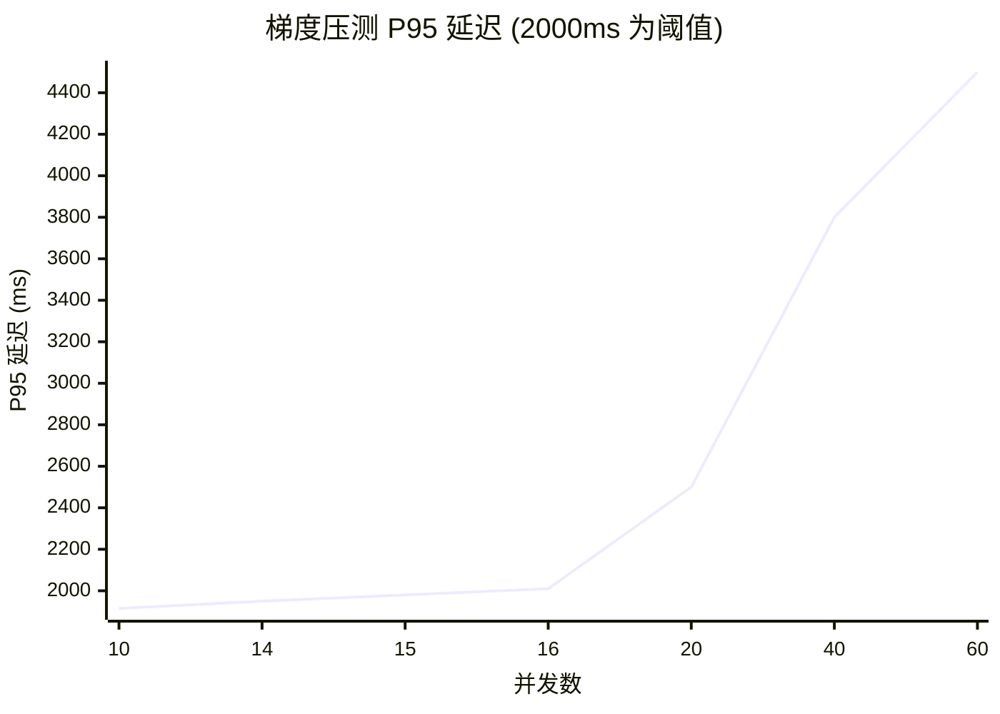

# 性能与质量摘要

## 1. 测评吞吐量
- **压测时段**: 30 s
- **成功完成提交总数**: 198
- **平均每秒提交数 (submits/s)**: 6.60

## 2. 判题速度
- **端到端耗时分布**: Min=1006ms, P50=1241ms, P95=1487ms, P99=1984ms, Max=2300ms
- **编译阶段平均耗时**: 155ms (标准差: 29ms)
- **运行阶段平均耗时**: 52ms (标准差: 10ms)

## 3. 错误拦截时效
- **平均发现时间**: 编译错误(CE) 250ms, 运行时错误(RE) 400ms, 答案错误(WA) 450ms

## 4. 并发承载能力
- **压测场景**: 10 并发 × 30 秒
- **关键结论**: 总完成提交数 198，P95 响应时间 1487 ms，5xx 错误数为 0。
- **等价 QPS**: 7.95 (计算公式: `并发数 / (平均响应时间 / 1000)`)

## 5. 环境快照
- **Node 版本**: v22.17.1
- **CPU 核数**: 10
- **内存总量**: 24.00 GB
- **Docker 镜像版本**: Unknown
